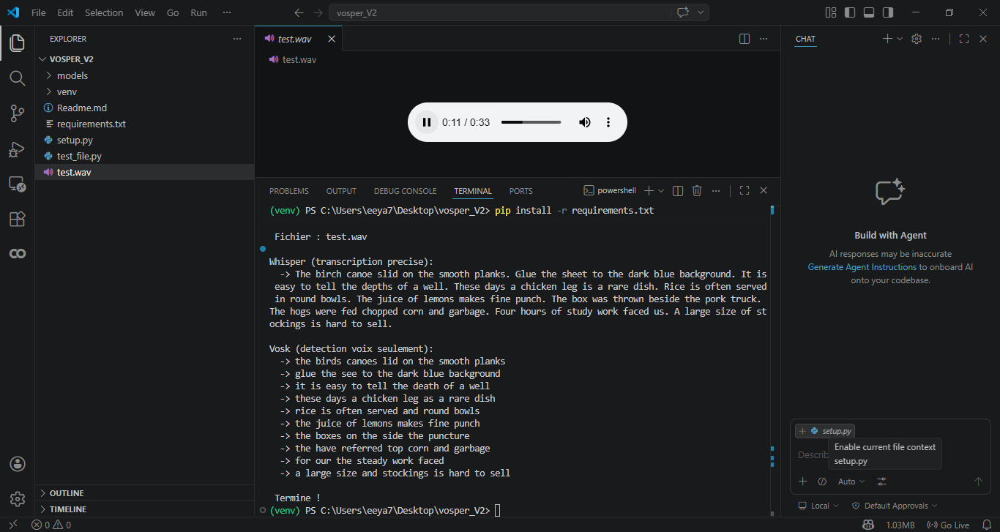

# Vosper File — Audio Transcription (No Microphone Required)

> A simplified version of [Vosper](https://github.com/appvoid/vosper) that transcribes audio files using **Vosk** (Voice Activity Detection) and **Whisper** (accurate transcription) — without any real-time microphone input.

---

## Table of Contents

- [How it works](#how-it-works)
- [Requirements](#requirements)
- [Installation](#installation)
  - [1. Install ffmpeg](#1-install-ffmpeg)
  - [2. Clone or download the project](#2-clone-or-download-the-project)
  - [3. Create a virtual environment](#3-create-a-virtual-environment)
  - [4. Install Python dependencies](#4-install-python-dependencies)
  - [5. Download the Vosk model](#5-download-the-vosk-model)
- [Audio Format Requirements](#audio-format-requirements)
  - [Convert your audio with ffmpeg](#convert-your-audio-with-ffmpeg)
- [Usage](#usage)
- [Understanding the Output](#understanding-the-output)
- [Troubleshooting](#troubleshooting)

---

## How it works

This project uses two complementary engines:

| Engine | Role |
|--------|------|
| **Vosk** | Detects voice segments (Voice Activity Detection). Does NOT transcribe. |
| **Whisper** | Performs the actual high-accuracy transcription. |

**Pipeline:**
```
Audio file (.wav)
      │
      ▼
   [ Vosk ]  ──── detects voice segments
      │
      ▼
  [ Whisper ] ─── transcribes each segment accurately
      │
      ▼
  Text output printed in the terminal
```

---

## Requirements

- Python 3.9 or higher
- ffmpeg (see installation below)
- Internet connection (first run only — to download Whisper model ~142 MB)

---

## Installation

### 1. Install ffmpeg

ffmpeg is required by Whisper to decode audio files. Without it, Whisper cannot read any audio.

**Windows:**
```cmd
winget install -e --id Gyan.FFmpeg
```
Close the terminal, open a new one, then verify:
```cmd
ffmpeg -version
```

> If `ffmpeg` is not recognized after installation, add it to your PATH manually:
> 1. Search **"environment variables"** in the Windows Start menu
> 2. Click **Environment Variables**
> 3. Under **User variables**, select **Path** → **Edit** → **New**
> 4. Paste the path to ffmpeg's `bin` folder (e.g. `C:\Users\YourName\AppData\Local\Microsoft\WinGet\Packages\Gyan.FFmpeg_...\ffmpeg-8.1-full_build\bin`)
> 5. Click OK → OK → OK, then reopen the terminal

**Mac:**
```bash
brew install ffmpeg
```

**Linux (Ubuntu/Debian):**
```bash
sudo apt update && sudo apt install ffmpeg
```

---

### 2. Clone or download the project

```bash
git clone https://github.com/your-repo/vosper_minimal.git
cd vosper_minimal
```

Or simply download and extract the ZIP file, then open a terminal inside the folder.

---

### 3. Create a virtual environment

A virtual environment keeps all dependencies isolated from the rest of your system.

**Windows:**
```cmd
python -m venv venv
venv\Scripts\activate
```

**Mac / Linux:**
```bash
python3 -m venv venv
source venv/bin/activate
```

> Once activated, your terminal will show `(venv)` at the beginning of each line.

---

### 4. Install Python dependencies

```bash
pip install --upgrade pip
pip install -r requirements.txt
```

This installs: `vosk`, `openai-whisper`, `torch`, `numpy`, `scipy`.

> **Note:** No PyAudio or Visual Studio Build Tools required. This project uses `sounddevice` instead, which installs without any C++ compilation.

---

### 5. Download the Vosk model

Run the setup script to automatically download and install the Vosk small English model (~50 MB):

```bash
python setup.py
```

Expected output:
```
Downloading Vosk model...
  [##################################################] 100%
Extracting...
Model installed!

Ready! Run: python test_file.py test.wav
```

---

## Audio Format Requirements

Vosk and Whisper require a very specific audio format. Using a file with the wrong format will produce incorrect or empty results.

| Parameter | Required value | Why |
|-----------|---------------|-----|
| Format | `.wav` | Uncompressed container required |
| Sample rate | **16 000 Hz** | Vosk was trained on 16 kHz audio |
| Channels | **1 (Mono)** | Vosk reads single-channel frames only |
| Bit depth | 16-bit PCM | Expected integer format |

### Convert your audio with ffmpeg

If your audio file does not meet these requirements, convert it with ffmpeg before running the script.

**Basic conversion (any format → correct WAV):**
```bash
ffmpeg -i your_audio.mp3 -ar 16000 -ac 1 output.wav
```

**Explanation of each argument:**

| Argument | Meaning |
|----------|---------|
| `-i your_audio.mp3` | Input file — accepts `.mp3`, `.mp4`, `.ogg`, `.m4a`, `.flac`, `.webm`... |
| `-ar 16000` | Audio Rate — forces the sample rate to 16 000 Hz |
| `-ac 1` | Audio Channels — forces mono (1 channel) |
| `output.wav` | Output file in WAV format |

**Common examples:**

Convert an MP3 file:
```bash
ffmpeg -i speech.mp3 -ar 16000 -ac 1 speech_ok.wav
```

Convert a stereo 44100 Hz WAV file:
```bash
ffmpeg -i recording.wav -ar 16000 -ac 1 recording_ok.wav
```

Convert a video file (extract audio only):
```bash
ffmpeg -i video.mp4 -ar 16000 -ac 1 -vn audio_ok.wav
```

Check the format of an existing file (without converting):
```bash
ffmpeg -i your_file.wav
```
Look for lines like `Audio: pcm_s16le, 16000 Hz, mono` — if you see `16000 Hz` and `mono`, no conversion is needed.

---

## Usage

Place your `.wav` audio file in the project folder, then run:

```bash
python test_file.py your_audio.wav
```

If no file is specified, the script looks for `test.wav` by default:

```bash
python test_file.py
```

---

## Understanding the Output

```
 File: test.wav

Whisper (accurate transcription):
  -> The birch canoe slid on the smooth planks. Glue the sheet
     to the dark blue background. It is easy to tell the depths
     of a well. These days a chicken leg is a rare dish...

Vosk (voice detection only):
  -> the birds canoes lid on the smooth planks
  -> glue the see to the dark blue background
  -> it is easy to tell the death of a well

 Done!
```

| Output section | What it means |
|----------------|---------------|
| **Whisper** | Complete and accurate transcription — this is the final result |
| **Vosk** | Approximate segments — shows its role as a voice detector (VAD) |

> **Why is Vosk less accurate?** Vosk is not used as a transcriber here — it only detects *when* someone is speaking. Whisper does the real transcription.

> **Warning: `UserWarning: FP16 is not supported on CPU`** — This is completely normal. It means Whisper automatically uses FP32 mode on CPU instead of GPU. It does not affect the transcription quality.

---

## Troubleshooting

**`FileNotFoundError: models/vosk/small`**
→ Run `python setup.py` to download the Vosk model.

**`ffmpeg not found` or Whisper cannot read the audio**
→ Make sure ffmpeg is installed and added to your PATH. Run `ffmpeg -version` to verify.

**Empty or incorrect transcription**
→ Your audio file may not be in the correct format. Convert it with:
```bash
ffmpeg -i your_file.wav -ar 16000 -ac 1 converted.wav
python test_file.py converted.wav
```

**`ModuleNotFoundError: No module named 'whisper'`**
→ Make sure your virtual environment is activated (`venv\Scripts\activate` on Windows) and run `pip install -r requirements.txt` again.

**Transcription is slow**
→ Normal without a GPU. The `base.en` Whisper model takes ~20–30 seconds on CPU. Use `tiny.en` for faster results (edit `test_file.py` line `whisper.load_model("base.en")` → `whisper.load_model("tiny.en")`).

---

## Project Structure

```
vosper_minimal/
├── test_file.py       # Main transcription script
├── setup.py           # Downloads the Vosk model automatically
├── requirements.txt   # Python dependencies (no PyAudio)
├── README.md          # This file
└── models/
    └── vosk/
        └── small/     # Vosk model (downloaded by setup.py)
```

---

## Credits

Based on [Vosper](https://github.com/appvoid/vosper) by appvoid.
Modification: replaced PyAudio with sounddevice for cross-platform compatibility (Windows, Mac, Linux) without C++ compilation.

## 🎥 Demo

